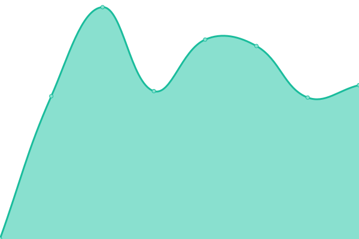

# [📈 Live Status](https://andou.github.io/bitmama-uptime): <!--live status--> **🟧 Partial outage**

This repository contains the open-source uptime monitor and status page for [Antonio Pastorino](https://andou.github.io/bitmama-uptime), powered by [Upptime](https://github.com/upptime/upptime).

With [Upptime](https://upptime.js.org), you can get your own unlimited and free uptime monitor and status page, powered entirely by a GitHub repository. We use [Issues](https://github.com/andou/bitmama-uptime/issues) as incident reports, [Actions](https://github.com/andou/bitmama-uptime/actions) as uptime monitors, and [Pages](https://andou.github.io/bitmama-uptime) for the status page.

<!--start: status pages-->
<!-- This summary is generated by Upptime (https://github.com/upptime/upptime) -->
<!-- Do not edit this manually, your changes will be overwritten -->
<!-- prettier-ignore -->
| URL | Status | History | Response Time | Uptime |
| --- | ------ | ------- | ------------- | ------ |
|  [NEXI > AEM HP](https://www.nexi.it/shop) | 🟩 Up | [nexi-aem-hp.yml](https://github.com/andou/bitmama-uptime/commits/HEAD/history/nexi-aem-hp.yml) | 

 1487ms
     
 | 

<a href="https://andou.github.io/bitmama-uptime/history/nexi-aem-hp">100.00%</a>
    

|  [NEXI > Login Page](https://www.nexi.it/shop/cart/customer/account/login) | 🟩 Up | [nexi-login-page.yml](https://github.com/andou/bitmama-uptime/commits/HEAD/history/nexi-login-page.yml) | 

 827ms
     
 | 

<a href="https://andou.github.io/bitmama-uptime/history/nexi-login-page">100.00%</a>
    

|  [NEXI > Configuratore SmartPOS](https://www.nexi.it/shop/cart/smartpos.html?m=wifi) | 🟩 Up | [nexi-configuratore-smart-pos.yml](https://github.com/andou/bitmama-uptime/commits/HEAD/history/nexi-configuratore-smart-pos.yml) | 

 2281ms
     
 | 

<a href="https://andou.github.io/bitmama-uptime/history/nexi-configuratore-smart-pos">100.00%</a>
    

|  [BITMAMA > IT HOMEPAGE](https://www.bitmama.it/) | 🟩 Up | [bitmama-it-homepage.yml](https://github.com/andou/bitmama-uptime/commits/HEAD/history/bitmama-it-homepage.yml) | 

 781ms
     
 | 

<a href="https://andou.github.io/bitmama-uptime/history/bitmama-it-homepage">100.00%</a>
    

|  [TOTEM > EN Homepage](https://replytotem.com/) | 🟩 Up | [totem-en-homepage.yml](https://github.com/andou/bitmama-uptime/commits/HEAD/history/totem-en-homepage.yml) | 

 2543ms
     
 | 

<a href="https://andou.github.io/bitmama-uptime/history/totem-en-homepage">100.00%</a>
    

|  [TOTEM > IT Homepage](https://replytotem.com/it/) | 🟩 Up | [totem-it-homepage.yml](https://github.com/andou/bitmama-uptime/commits/HEAD/history/totem-it-homepage.yml) | 

 681ms
     
 | 

<a href="https://andou.github.io/bitmama-uptime/history/totem-it-homepage">100.00%</a>
    

|  [ANTONIA > IT Homepage](https://www.antonia.it/it) | 🟩 Up | [antonia-it-homepage.yml](https://github.com/andou/bitmama-uptime/commits/HEAD/history/antonia-it-homepage.yml) | 

 2997ms
     
 | 

<a href="https://andou.github.io/bitmama-uptime/history/antonia-it-homepage">100.00%</a>
    

|  [ANTONIA > US Homepage](https://www.antonia.it/us/) | 🟩 Up | [antonia-us-homepage.yml](https://github.com/andou/bitmama-uptime/commits/HEAD/history/antonia-us-homepage.yml) | 

 1884ms
     
 | 

<a href="https://andou.github.io/bitmama-uptime/history/antonia-us-homepage">100.00%</a>
    

|  [KHRISJOY > IT Homepage](https://www.khrisjoy.com/it/) | 🟩 Up | [khrisjoy-it-homepage.yml](https://github.com/andou/bitmama-uptime/commits/HEAD/history/khrisjoy-it-homepage.yml) | 

 1913ms
     
 | 

<a href="https://andou.github.io/bitmama-uptime/history/khrisjoy-it-homepage">100.00%</a>
    

|  [KHRISJOY > US Homepage](https://www.khrisjoy.com/us/) | 🟩 Up | [khrisjoy-us-homepage.yml](https://github.com/andou/bitmama-uptime/commits/HEAD/history/khrisjoy-us-homepage.yml) | 

 893ms
     
 | 

<a href="https://andou.github.io/bitmama-uptime/history/khrisjoy-us-homepage">100.00%</a>
    

|  [PHILIPPE MATIGNON > IT Homepage](https://www.philippematignon.it/pm_it/) | 🟩 Up | [philippe-matignon-it-homepage.yml](https://github.com/andou/bitmama-uptime/commits/HEAD/history/philippe-matignon-it-homepage.yml) | 

 2414ms
     
 | 

<a href="https://andou.github.io/bitmama-uptime/history/philippe-matignon-it-homepage">100.00%</a>
    

|  [PHILIPPE MATIGNON > EN Homepage](https://www.philippematignon.it/pm_en/) | 🟩 Up | [philippe-matignon-en-homepage.yml](https://github.com/andou/bitmama-uptime/commits/HEAD/history/philippe-matignon-en-homepage.yml) | 

 1178ms
     
 | 

<a href="https://andou.github.io/bitmama-uptime/history/philippe-matignon-en-homepage">100.00%</a>
    

|  [ZEGNA > Zegna Group](https://www.zegnagroup.com/it/) | 🟩 Up | [zegna-zegna-group.yml](https://github.com/andou/bitmama-uptime/commits/HEAD/history/zegna-zegna-group.yml) | 

 506ms
     
 | 

<a href="https://andou.github.io/bitmama-uptime/history/zegna-zegna-group">100.00%</a>
    

|  [ZEGNA > Zegna Forest](https://zegnaforest.fondazionezegna.org/it/) | 🟩 Up | [zegna-zegna-forest.yml](https://github.com/andou/bitmama-uptime/commits/HEAD/history/zegna-zegna-forest.yml) | 

 478ms
     
 | 

<a href="https://andou.github.io/bitmama-uptime/history/zegna-zegna-forest">100.00%</a>
    

|  [Giro D'Italia > IT Homepage](https://www.giroditalia.it/) | 🟩 Up | [giro-d-italia-it-homepage.yml](https://github.com/andou/bitmama-uptime/commits/HEAD/history/giro-d-italia-it-homepage.yml) | 

 1248ms
     
 | 

<a href="https://andou.github.io/bitmama-uptime/history/giro-d-italia-it-homepage">100.00%</a>
    

|  [Giro D'Italia > EN Homepage](https://www.giroditalia.it/en/) | 🟩 Up | [giro-d-italia-en-homepage.yml](https://github.com/andou/bitmama-uptime/commits/HEAD/history/giro-d-italia-en-homepage.yml) | 

 911ms
     
 | 

<a href="https://andou.github.io/bitmama-uptime/history/giro-d-italia-en-homepage">100.00%</a>
    

|  [Giro D'Italia > IT Media Center](https://www.giroditalia.it/media-center/sport/news/) | 🟩 Up | [giro-d-italia-it-media-center.yml](https://github.com/andou/bitmama-uptime/commits/HEAD/history/giro-d-italia-it-media-center.yml) | 

 1131ms
     
 | 

<a href="https://andou.github.io/bitmama-uptime/history/giro-d-italia-it-media-center">100.00%</a>
    

|  [Giro D'Italia > IT Percorso](https://www.giroditalia.it/il-percorso/) | 🟩 Up | [giro-d-italia-it-percorso.yml](https://github.com/andou/bitmama-uptime/commits/HEAD/history/giro-d-italia-it-percorso.yml) | 

 517ms
     
 | 

<a href="https://andou.github.io/bitmama-uptime/history/giro-d-italia-it-percorso">100.00%</a>
    

|  [Strade Bianche > HP IT](https://www.strade-bianche.it/) | 🟩 Up | [strade-bianche-hp-it.yml](https://github.com/andou/bitmama-uptime/commits/HEAD/history/strade-bianche-hp-it.yml) | 

 1324ms
     
 | 

<a href="https://andou.github.io/bitmama-uptime/history/strade-bianche-hp-it">100.00%</a>
    

|  [Tirreno Adriatico > HP IT](https://www.tirrenoadriatico.it/) | 🟩 Up | [tirreno-adriatico-hp-it.yml](https://github.com/andou/bitmama-uptime/commits/HEAD/history/tirreno-adriatico-hp-it.yml) | 

 1281ms
     
 | 

<a href="https://andou.github.io/bitmama-uptime/history/tirreno-adriatico-hp-it">100.00%</a>
    

|  [Milano Sanremo > HP IT](https://www.milanosanremo.it/) | 🟩 Up | [milano-sanremo-hp-it.yml](https://github.com/andou/bitmama-uptime/commits/HEAD/history/milano-sanremo-hp-it.yml) | 

 1221ms
     
 | 

<a href="https://andou.github.io/bitmama-uptime/history/milano-sanremo-hp-it">100.00%</a>
    

|  [Milano Torino > HP IT](https://www.milanotorino.it/) | 🟩 Up | [milano-torino-hp-it.yml](https://github.com/andou/bitmama-uptime/commits/HEAD/history/milano-torino-hp-it.yml) | 

 1106ms
     
 | 

<a href="https://andou.github.io/bitmama-uptime/history/milano-torino-hp-it">100.00%</a>
    

|  [Gran Piemonte > HP IT](https://www.ilgranpiemonte.it/) | 🟩 Up | [gran-piemonte-hp-it.yml](https://github.com/andou/bitmama-uptime/commits/HEAD/history/gran-piemonte-hp-it.yml) | 

 1066ms
     
 | 

<a href="https://andou.github.io/bitmama-uptime/history/gran-piemonte-hp-it">100.00%</a>
    

|  [Il Lombardia > HP IT](https://www.ilombardia.it/) | 🟩 Up | [il-lombardia-hp-it.yml](https://github.com/andou/bitmama-uptime/commits/HEAD/history/il-lombardia-hp-it.yml) | 

 1047ms
     
 | 

<a href="https://andou.github.io/bitmama-uptime/history/il-lombardia-hp-it">100.00%</a>
    

|  [Giro Di Sicilia > HP IT](https://ilgirodisicilia.it/) | 🟥 Down | [giro-di-sicilia-hp-it.yml](https://github.com/andou/bitmama-uptime/commits/HEAD/history/giro-di-sicilia-hp-it.yml) | 

 1091ms
     
 | 

<a href="https://andou.github.io/bitmama-uptime/history/giro-di-sicilia-hp-it">100.00%</a>
    

<!--end: status pages-->

[**Visit our status website →**](https://andou.github.io/bitmama-uptime)

## 📄 License

- Powered by: [Upptime](https://github.com/upptime/upptime)
- Code: [MIT](./LICENSE) © [Antonio Pastorino](https://andou.github.io/bitmama-uptime)
- Data in the `./history` directory: [Open Database License](https://opendatacommons.org/licenses/odbl/1-0/)
